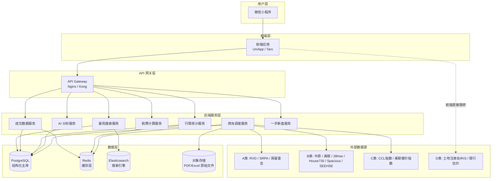
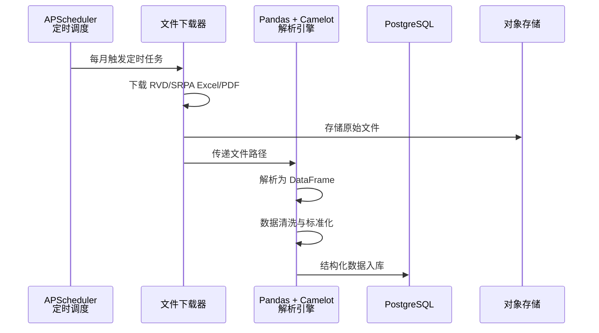
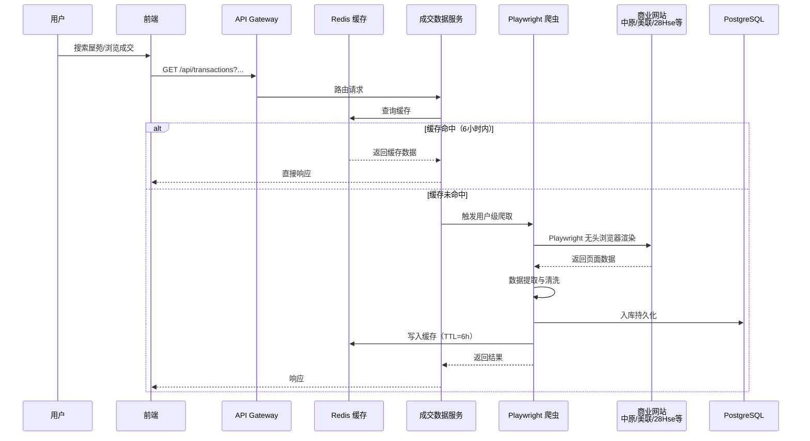
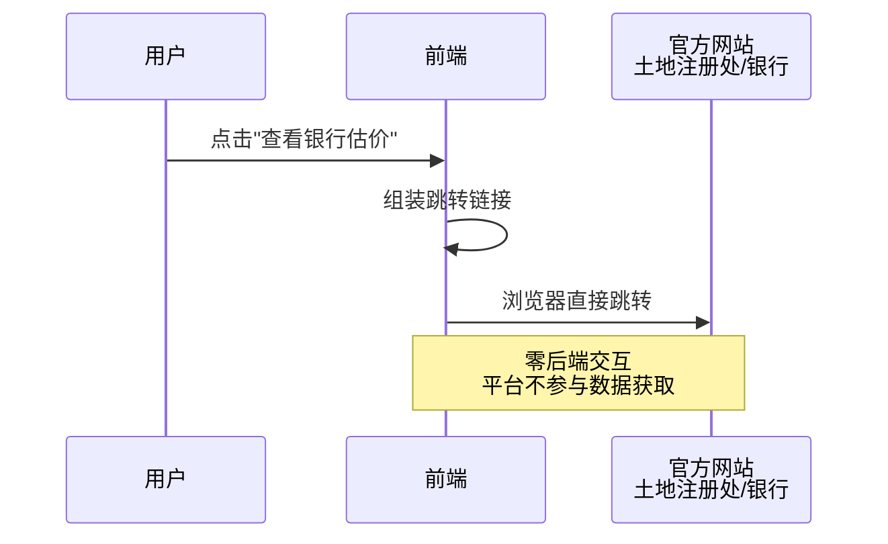
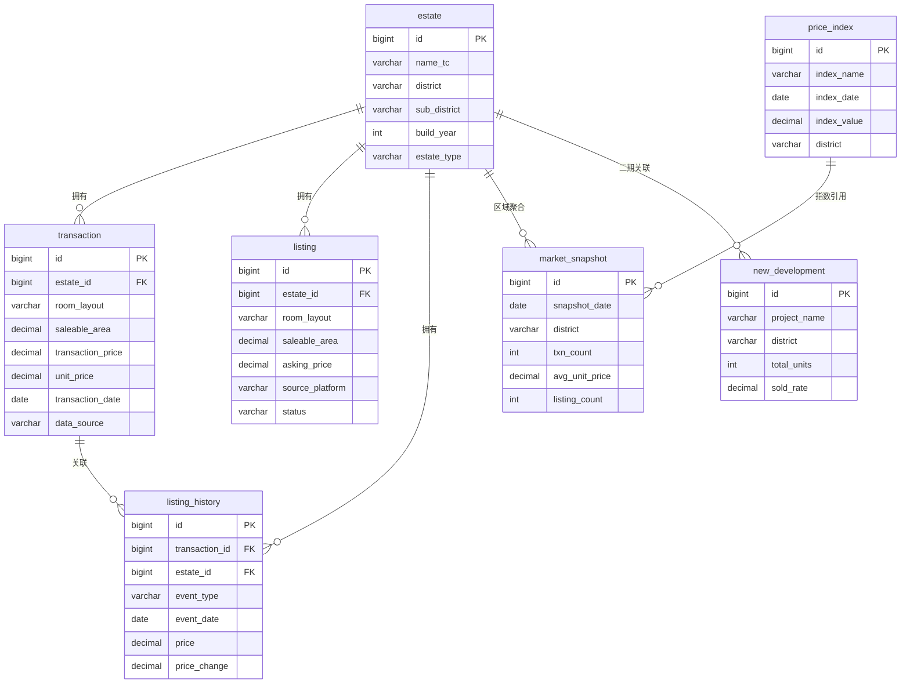

# 香港房产数据智能查询平台 -- 项目介绍文档

> 文档版本：V1.0 | 日期：2026-04-24 | 面向读者：技术决策层

---

## 目录

1. [背景与目标](#1-背景与目标)
2. [需求与范围（MVP / 二期）](#2-需求与范围mvp--二期)
3. [信息架构与页面清单](#3-信息架构与页面清单)
4. [系统总体设计](#4-系统总体设计)
5. [数据与接口](#5-数据与接口)
6. [安全、合规与隐私](#6-安全合规与隐私)
7. [非功能需求](#7-非功能需求)
8. [实施计划](#8-实施计划)
9. [待确认事项清单](#9-待确认事项清单)

---

## 1. 背景与目标

### 1.1 行业痛点

香港楼市长期缺乏一个面向普通购房者与投资者的**统一、透明、智能化**数据查询工具。现有信息分散在多个渠道：

| 痛点         | 说明                                                                             |
| ------------ | -------------------------------------------------------------------------------- |
| 数据碎片化   | 成交数据散落在土地注册处、差饷物业估价署、各中介平台，用户需逐一查阅             |
| 信息滞后     | 官方数据发布周期长（月度/季度），无法反映即时市场动态                            |
| 缺乏智能分析 | 现有平台以原始数据展示为主，缺少估值对比、趋势可视化和投资回报测算等辅助决策功能 |
| 门槛高       | 土地注册处查册需付费且操作复杂，银行估价系统分散在各行网站，普通用户难以高效使用 |

### 1.2 对标产品

本项目对标内地已成熟运营的**深圳房价查询类微信小程序**。该类产品已验证了以下核心能力的商业可行性：

- 全城成交实时浏览（按区域/户型/面积/价格筛选）
- 小区维度深度查询（成交记录 + 在售房源 + 租赁成交 + 行情统计）
- 新房备案数据透明化（备案进度/房源表/价格分析）
- 新房行情大盘统计与趋势图
- 楼市行情日报（成交数据 + 挂盘房源 + 分区详情）
- 增值业务（购房咨询）及内容生态（楼市资讯聚合）

本项目需在上述能力基础上，**适配香港市场特征**：

| 维度       | 内地（深圳）               | 香港                                                            |
| ---------- | -------------------------- | --------------------------------------------------------------- |
| 面积单位   | 平方米 (m²)                | 平方呎 (呎)                                                     |
| 货币       | 人民币 (CNY)               | 港币 (HKD)                                                      |
| 行政区划   | 区 → 街道 → 小区           | 区域 (港岛/九龙/新界) → 分区 → 屋苑                             |
| 官方数据源 | 住建局网签系统             | 土地注册处、差饷物业估价署 (RVD)、一手住宅物业销售监管局 (SRPA) |
| 行业指数   | 国家统计局70城房价指数     | 中原城市领先指数 (CCL)、美联楼价指数                            |
| 税费体系   | 契税 + 增值税 + 个人所得税 | 从价印花税 + 买家印花税 (BSD) + 新住宅印花税 (NRSD)             |

### 1.3 项目目标

打造**"一站式香港房产数据智能查询平台"**，核心目标：

1. **数据聚合** -- 整合官方与商业数据源，提供全港成交、屋苑行情、一手新盘等核心数据查询
2. **智能分析** -- 引入 AI 估值对比（对标银行估价）、历史成交趋势分析、投资回报测算
3. **体验优先** -- 以**微信小程序**为唯一客户端，提供低门槛、高效率的信息获取体验
4. **合规底线** -- 严格遵守香港法律法规，对高风险数据源采用零爬取策略

---

## 2. 需求与范围（MVP / 二期）

### 2.1 MVP（最小可行产品）

MVP 聚焦**二手房成交数据查询 + 智能分析**，覆盖用户最高频的核心场景。

| 功能模块    | 功能描述                                                                      | 数据源依赖                 |
| ----------- | ----------------------------------------------------------------------------- | -------------------------- |
| 屋苑搜索    | 按名称模糊搜索屋苑，展示屋苑基础信息与历史成交                                | A 类 + B 类                |
| 全港成交    | 全港最新真实成交记录浏览，支持区域/户型/面积/楼价/排序多维筛选                | A 类 + B 类                |
| 成交详情    | 单笔成交的完整信息：物业属性、AI 估值对比、放盘及交易历程、历史成交参考散点图 | A 类 + B 类 + D 类（跳转） |
| 行情统计    | 全港及分区维度的成交量价趋势、挂盘房源统计、分区对比                          | A 类 + C 类                |
| 税费计算    | 根据买家身份和物业价格，自动计算从价印花税、买家印花税等各项税费              | 本地算法                   |
| AI 估值对比 | 将成交价与银行估价做自动对比，标注折让/溢价比例                               | D 类（跳转获取）           |

### 2.2 二期功能

| 功能模块         | 功能描述                                               | 优先级 |
| ---------------- | ------------------------------------------------------ | ------ |
| 一手新盘         | 新盘价单、销售进度、成交统计（对标深圳"新房备案"）     | 高     |
| AI 评测助手      | 基于 LLM 的对话式购房顾问，支持自然语言查询与投资建议  | 高     |
| 资产新闻智库     | 楼市资讯聚合，结合 AI 摘要与情绪分析                   | 中     |
| 专家购房咨询     | 付费增值服务，对接专业顾问提供一对一咨询               | 中     |
| 用户中心         | 关注屋苑、浏览记录、价格变动提醒推送                   | 中     |
| 全成本与回报测算 | 购房全成本（印花税 + 按揭 + 预期租金回报）一站式计算器 | 高     |

### 2.3 不在范围内

- 租赁市场独立频道（二期末尾评估）
- 商业物业 / 工业物业数据
- 自建估价模型（MVP 阶段仅对接银行估价做对比）

---

## 3. 信息架构与页面清单

### 3.1 整体信息架构

基于既定原型图，平台采用 **底部双 Tab** 结构：

```
┌─────────────────────────────────────────┐
│                  首页                    │
│  ┌─────────────────────────────────────┐│
│  │ 搜索栏（输入屋苑名）               ││
│  ├─────────────────────────────────────┤│
│  │ 数据工具（6 宫格）                  ││
│  │  屋苑搜索 | 全港成交 | 行情统计     ││
│  │  一手新盘 | 税费计算 | AI评测助手   ││
│  ├─────────────────────────────────────┤│
│  │ 增值业务                            ││
│  │  资产新闻智库 | 专家购房咨询        ││
│  └─────────────────────────────────────┘│
├──────────┬──────────────────────────────┤
│ 数据工具 │          AI 智投             │
└──────────┴──────────────────────────────┘
```

### 3.2 页面清单

| 编号 | 页面名称           | 所属层级     | 阶段 | 功能要点                                                                                                                                                                                        |
| ---- | ------------------ | ------------ | ---- | ----------------------------------------------------------------------------------------------------------------------------------------------------------------------------------------------- |
| P01  | 首页               | Tab-1 根页面 | MVP  | 搜索栏 + 数据工具六宫格 + 增值业务入口 + AI 顾问浮窗入口                                                                                                                                        |
| P02  | 屋苑搜索页         | 一级页面     | MVP  | 模糊搜索 + 搜索历史 + 搜索结果列表（屋苑卡片）                                                                                                                                                  |
| P03  | 屋苑详情页         | 二级页面     | MVP  | Tab 切换：成交记录 / 在售房源 / 行情统计；支持户型、面积、年份筛选                                                                                                                              |
| P04  | 全港成交列表页     | 一级页面     | MVP  | AI 洞察横幅 + 成交卡片列表 + 多维筛选（区域/周期/面积/楼价/排序）                                                                                                                               |
| P05  | 成交详情页         | 二级页面     | MVP  | 物业基础信息 + 价格摘要（成交价/单价/议价率/放盘周期）+ AI 估值对比卡片 + 物业属性六宫格 + 放盘及交易历程时间线 + 历史成交参考散点图 + 全成本与回报测算入口 + 底部操作栏（关注屋苑/咨询AI顾问） |
| P06  | 行情统计页         | 一级页面     | MVP  | 行情日报（成交数据 + 挂盘房源）+ 二手房/新房趋势图 + 分区详情表                                                                                                                                 |
| P07  | 税费计算器页       | 一级页面     | MVP  | 输入物业价格 + 买家身份 → 自动计算各项印花税                                                                                                                                                    |
| P08  | 一手新盘列表页     | 一级页面     | 二期 | 按区域 Tab 切换 + 新盘卡片（项目名/区域/面积范围/价格范围/已售比例）                                                                                                                            |
| P09  | 一手新盘详情页     | 二级页面     | 二期 | Tab 切换：销售进度 / 房源表 / 价格分析                                                                                                                                                          |
| P10  | AI 评测助手页      | 一级页面     | 二期 | 对话式交互界面，支持自然语言提问                                                                                                                                                                |
| P11  | 资产新闻智库页     | 一级页面     | 二期 | 资讯 Feed 流 + 分类/标签筛选                                                                                                                                                                    |
| P12  | 专家购房咨询页     | 一级页面     | 二期 | 咨询服务介绍 + 预约/支付入口                                                                                                                                                                    |
| P13  | AI 智投 Tab        | Tab-2 根页面 | 二期 | AI 综合投资面板（待确认具体功能定义）                                                                                                                                                           |
| P14  | 全成本与回报测算页 | 二级页面     | MVP  | 印花税 + 按揭月供 + 预期租金回报率综合计算                                                                                                                                                      |
| P15  | 在售房源详情页     | 三级页面     | MVP  | 单套在售房源信息 + 历史调价记录弹窗                                                                                                                                                             |

### 3.3 原型图与对标功能映射

| 原型页面              | 对标深圳功能             | 差异化说明                                                                            |
| --------------------- | ------------------------ | ------------------------------------------------------------------------------------- |
| 首页展示页（图1）     | 深圳首页（数据工具矩阵） | 增加 AI 顾问入口、AI 智投 Tab；视觉风格采用深色系                                     |
| 房屋浏览页（图2）     | 深圳全城成交             | 增加 AI 洞察横幅（市场动态摘要）；成交卡片增加涨跌幅标签                              |
| 房屋详细信息页（图3） | 深圳成交记录详情         | 增加 AI 估值对比卡片（银行估价对照）、全成本回报测算入口；放盘历程展示调价/议价全过程 |

---

## 4. 系统总体设计

### 4.1 架构总览

系统采用**前后端分离 + 微服务**架构，后端以 Python 为主要技术栈（与数据采集层统一），通过 API Gateway 对外暴露统一的 RESTful 接口。



### 4.2 模块职责

| 模块                     | 职责                                                  | 关键技术                                                                                    |
| ------------------------ | ----------------------------------------------------- | ------------------------------------------------------------------------------------------- |
| **前端应用**             | **仅微信小程序**：页面交互、数据展示、图表渲染        | 微信原生小程序框架，或 Taro / UniApp **仅输出小程序端**；图表可用 ECharts for 微信小程序 等 |
| **API Gateway**          | 统一入口、请求路由、限流、鉴权、日志                  | Nginx / Kong                                                                                |
| **屋苑搜索服务**         | 屋苑模糊搜索、搜索建议、热门推荐                      | Elasticsearch 全文检索                                                                      |
| **成交数据服务**         | 成交记录 CRUD、多维筛选、成交详情组装（含交易历程）   | PostgreSQL + Redis                                                                          |
| **行情统计服务**         | 行情日报生成、趋势数据聚合、分区统计、指数对接        | 定时聚合任务、时序数据处理                                                                  |
| **税费计算服务**         | 根据物业价格与买家身份计算各类印花税                  | 纯算法服务，无外部依赖                                                                      |
| **AI 分析服务**          | AI 估值对比生成、历史趋势分析文案、对话式问答（二期） | LLM API（待确认具体模型）                                                                   |
| **爬虫调度服务**         | 统一管理 A/B/C 三类数据源的采集任务调度与执行         | APScheduler + Playwright + Pandas + Camelot                                                 |
| **一手新盘服务**（二期） | 新盘列表、销售进度、房源表、价格分析                  | 依赖 A 类（SRPA）数据                                                                       |

### 4.3 核心数据流

#### 4.3.1 A 类数据 -- 官方静态数据流



#### 4.3.2 B 类数据 -- 商业动态数据流



#### 4.3.3 C 类数据 -- 行业指数数据流

C 类指数数据采用**寄生式采集**策略：在执行 B 类主任务时同步并行抓取指数信息，清洗后存入独立索引表，供行情统计模块直接查询。

#### 4.3.4 D 类数据 -- 法律壁垒数据流



### 4.4 技术选型汇总

| 层次         | 技术选型                             | 选型依据                                                         |
| ------------ | ------------------------------------ | ---------------------------------------------------------------- |
| **前端框架** | 微信原生 / Taro / UniApp（仅小程序） | 本项目范围不含 H5；若选用 Taro/UniApp，仅启用小程序构建目标即可  |
| **前端图表** | ECharts                              | 支持散点图、折线图、柱状图，满足历史成交趋势、行情统计等图表需求 |
| **API 网关** | Nginx + Kong                         | 成熟稳定，支持限流、鉴权、日志                                   |
| **后端框架** | Python FastAPI                       | 异步高性能，与数据采集层（Python 生态）天然统一                  |
| **定时调度** | APScheduler                          | PDF 明确指定；轻量级，适合 A 类月度定时任务                      |
| **文件解析** | Pandas + Camelot                     | PDF 明确指定；Pandas 处理 Excel，Camelot 处理 PDF 表格提取       |
| **动态爬虫** | Playwright                           | PDF 明确指定；支持无头浏览器渲染 SPA 页面                        |
| **缓存**     | Redis                                | PDF 明确指定；B 类数据 6 小时 TTL 缓存                           |
| **主数据库** | PostgreSQL                           | 支持 JSONB，适合半结构化物业数据；成熟的地理空间扩展 (PostGIS)   |
| **搜索引擎** | Elasticsearch                        | 屋苑名称模糊搜索、拼音/繁简体搜索                                |
| **对象存储** | MinIO / 云 OSS                       | 存储 A 类原始 PDF/Excel 文件                                     |
| **AI/LLM**   | 待确认                               | 估值对比文案生成、对话式顾问（二期）                             |

---

## 5. 数据与接口

### 5.1 数据源详情

#### 5.1.1 A 类 -- 官方静态数据

| 数据源                        | URL                                                                    | 数据内容                             | 更新频率                | 采集方式                                 | 存储策略                        |
| ----------------------------- | ---------------------------------------------------------------------- | ------------------------------------ | ----------------------- | ---------------------------------------- | ------------------------------- |
| 差饷物业估价署 (RVD)          | https://www.rvd.gov.hk/tc/publications/property_market_statistics.html | 官方楼价指数、各区均价、实用面积统计 | 月度                    | APScheduler 定时下载 Excel → Pandas 解析 | 入库 PostgreSQL，原始文件存 OSS |
| 一手住宅物业销售监管局 (SRPA) | https://www.srpa.gov.hk/tc/                                            | 新盘官方成交数据（价单、成交记录）   | 待确认（预计周度/月度） | APScheduler 定时下载 → Camelot 解析 PDF  | 入库 PostgreSQL，原始文件存 OSS |
| 香港房屋委员会                | https://www.housingauthority.gov.hk/tc/                                | 居屋、公屋成交数据                   | 待确认                  | APScheduler 定时下载 → Pandas 解析       | 入库 PostgreSQL                 |

#### 5.1.2 B 类 -- 商业动态数据

| 数据源         | URL                           | 数据内容                                   | 缓存策略     | 采集方式                  |
| -------------- | ----------------------------- | ------------------------------------------ | ------------ | ------------------------- |
| 中原地产       | https://www.centaline.com.hk/ | 全港成交记录、屋苑信息、在售房源、CCL 指数 | Redis TTL=6h | Playwright 用户触发式爬取 |
| 美联物业       | https://www.midland.com.hk/   | 成交记录、楼价指数、屋苑信息               | Redis TTL=6h | Playwright 用户触发式爬取 |
| 28Hse 香港屋网 | https://www.28hse.com/        | 二手放盘、租盘、成交参考                   | Redis TTL=6h | Playwright 用户触发式爬取 |
| House730       | https://www.house730.com/     | 二手放盘、新盘信息                         | Redis TTL=6h | Playwright 用户触发式爬取 |
| Spacious 千居  | https://www.spacious.hk/      | 二手/租盘、楼盘数据                        | Redis TTL=6h | Playwright 用户触发式爬取 |
| SEEHSE 搵楼街  | https://seehse.com/           | 二手放盘、成交参考                         | Redis TTL=6h | Playwright 用户触发式爬取 |

#### 5.1.3 C 类 -- 行业宏观指数

| 数据源                   | 数据内容                   | 采集方式                  | 存储策略               |
| ------------------------ | -------------------------- | ------------------------- | ---------------------- |
| 中原城市领先指数 (CCL)   | 全港及分区楼价指数周度变动 | 随 B 类主任务同步并行抓取 | 独立索引表，PostgreSQL |
| 中原城市大型屋苑领先指数 | 大型屋苑价格走势           | 随 B 类主任务同步并行抓取 | 独立索引表             |
| 美联楼价指数             | 楼价指数月度数据           | 随 B 类主任务同步并行抓取 | 独立索引表             |

#### 5.1.4 D 类 -- 法律壁垒数据

| 数据源                         | URL                                               | 数据内容                     | 平台处理方式                     |
| ------------------------------ | ------------------------------------------------- | ---------------------------- | -------------------------------- |
| 土地注册处 (IRIS)              | https://www.landreg.gov.hk/tc/monthly/monthly.htm | 成交记录、产权信息、抵押资料 | **零爬取**，前端提供官方链接跳转 |
| 银行在线估价系统（如中银香港） | https://www.bochk.com/mortgage/valuation.html     | 物业估价                     | **零爬取**，前端提供官方链接跳转 |

### 5.2 核心数据模型

#### 5.2.1 屋苑基础信息表 `estate`

| 字段         | 类型          | 说明                                   |
| ------------ | ------------- | -------------------------------------- |
| id           | BIGINT PK     | 主键                                   |
| name_tc      | VARCHAR(200)  | 繁体中文名称                           |
| name_sc      | VARCHAR(200)  | 简体中文名称                           |
| name_en      | VARCHAR(200)  | 英文名称                               |
| district     | VARCHAR(50)   | 所属区域（港岛/九龙/新界）             |
| sub_district | VARCHAR(100)  | 所属分区（如鲗鱼涌、沙田等）           |
| address      | TEXT          | 详细地址                               |
| build_year   | INT           | 建成年份                               |
| total_units  | INT           | 总户数（待确认）                       |
| estate_type  | VARCHAR(50)   | 屋苑类型（大型蓝筹屋苑/单幢楼/居屋等） |
| latitude     | DECIMAL(10,7) | 纬度（待确认是否需要地图功能）         |
| longitude    | DECIMAL(10,7) | 经度                                   |
| created_at   | TIMESTAMP     | 创建时间                               |
| updated_at   | TIMESTAMP     | 更新时间                               |

#### 5.2.2 成交记录表 `transaction`

| 字段              | 类型          | 说明                               |
| ----------------- | ------------- | ---------------------------------- |
| id                | BIGINT PK     | 主键                               |
| estate_id         | BIGINT FK     | 关联屋苑                           |
| block             | VARCHAR(50)   | 座/栋                              |
| floor             | VARCHAR(20)   | 楼层                               |
| unit              | VARCHAR(20)   | 单位                               |
| room_layout       | VARCHAR(50)   | 间隔结构（如 2房2厅1卫）           |
| saleable_area     | DECIMAL(10,2) | 实用面积（呎）                     |
| property_usage    | VARCHAR(50)   | 房屋用途（私人住宅/居屋等）        |
| orientation       | VARCHAR(50)   | 朝向（如东南）                     |
| view_type         | VARCHAR(100)  | 景观类型（如全海景）（待确认）     |
| transaction_price | DECIMAL(15,2) | 成交价（万港元）                   |
| unit_price        | DECIMAL(10,2) | 单价（HKD/呎）                     |
| transaction_date  | DATE          | 成交日期                           |
| registration_date | DATE          | 注册日期                           |
| last_asking_price | DECIMAL(15,2) | 最后叫价                           |
| negotiation_rate  | DECIMAL(5,2)  | 议价率（%）                        |
| listing_duration  | INT           | 放盘周期（天）                     |
| data_source       | VARCHAR(50)   | 数据来源（土地注册处/中原/美联等） |
| source_category   | CHAR(1)       | 数据源类别（A/B）                  |
| raw_data          | JSONB         | 原始抓取数据（用于回溯）           |
| created_at        | TIMESTAMP     | 入库时间                           |

#### 5.2.3 放盘及交易历程表 `listing_history`

| 字段           | 类型          | 说明                                                 |
| -------------- | ------------- | ---------------------------------------------------- |
| id             | BIGINT PK     | 主键                                                 |
| transaction_id | BIGINT FK     | 关联成交记录（可为空，在售房源无成交）               |
| estate_id      | BIGINT FK     | 关联屋苑                                             |
| event_type     | VARCHAR(30)   | 事件类型（首次挂牌/调价/业主急售/签约成交/正式售出） |
| event_date     | DATE          | 事件日期                                             |
| price          | DECIMAL(15,2) | 当时价格（万港元）                                   |
| price_change   | DECIMAL(15,2) | 价格变动（万港元，正为涨价，负为降价）               |
| remark         | TEXT          | 备注                                                 |
| created_at     | TIMESTAMP     | 入库时间                                             |

#### 5.2.4 在售房源表 `listing`

| 字段            | 类型          | 说明                           |
| --------------- | ------------- | ------------------------------ |
| id              | BIGINT PK     | 主键                           |
| estate_id       | BIGINT FK     | 关联屋苑                       |
| block           | VARCHAR(50)   | 座/栋                          |
| floor           | VARCHAR(20)   | 楼层                           |
| unit            | VARCHAR(20)   | 单位                           |
| room_layout     | VARCHAR(50)   | 间隔结构                       |
| saleable_area   | DECIMAL(10,2) | 实用面积（呎）                 |
| asking_price    | DECIMAL(15,2) | 当前挂牌价（万港元）           |
| unit_price      | DECIMAL(10,2) | 单价（HKD/呎）                 |
| listing_date    | DATE          | 挂牌日期                       |
| source_platform | VARCHAR(50)   | 来源平台（中原/美联/28Hse 等） |
| source_url      | TEXT          | 原始链接                       |
| status          | VARCHAR(20)   | 状态（在售/已下架/已成交）     |
| raw_data        | JSONB         | 原始数据                       |
| created_at      | TIMESTAMP     | 入库时间                       |
| updated_at      | TIMESTAMP     | 更新时间                       |

#### 5.2.5 楼价指数表 `price_index`

| 字段         | 类型          | 说明                                        |
| ------------ | ------------- | ------------------------------------------- |
| id           | BIGINT PK     | 主键                                        |
| index_name   | VARCHAR(100)  | 指数名称（CCL/美联楼价指数等）              |
| index_date   | DATE          | 指数日期                                    |
| index_value  | DECIMAL(10,2) | 指数值                                      |
| change_week  | DECIMAL(5,2)  | 周变动（%）                                 |
| change_month | DECIMAL(5,2)  | 月变动（%）                                 |
| district     | VARCHAR(50)   | 所属区域（全港/港岛/九龙/新界，视指数粒度） |
| created_at   | TIMESTAMP     | 入库时间                                    |

#### 5.2.6 行情统计快照表 `market_snapshot`

| 字段              | 类型          | 说明                             |
| ----------------- | ------------- | -------------------------------- |
| id                | BIGINT PK     | 主键                             |
| snapshot_date     | DATE          | 快照日期                         |
| district          | VARCHAR(50)   | 区域                             |
| txn_count         | INT           | 成交宗数                         |
| avg_price         | DECIMAL(15,2) | 均价（万港元）                   |
| avg_unit_price    | DECIMAL(10,2) | 均呎价（HKD/呎）                 |
| listing_count     | INT           | 在售房源数                       |
| avg_listing_price | DECIMAL(10,2) | 挂盘均价（HKD/呎）               |
| price_up_count    | INT           | 涨价房源数                       |
| price_down_count  | INT           | 降价房源数                       |
| period_type       | VARCHAR(10)   | 统计周期（daily/weekly/monthly） |
| created_at        | TIMESTAMP     | 入库时间                         |

#### 5.2.7 一手新盘表 `new_development`（二期）

| 字段            | 类型          | 说明             |
| --------------- | ------------- | ---------------- |
| id              | BIGINT PK     | 主键             |
| project_name    | VARCHAR(200)  | 项目名称         |
| developer       | VARCHAR(200)  | 开发商           |
| district        | VARCHAR(50)   | 所属区域         |
| address         | TEXT          | 地址             |
| total_units     | INT           | 总套数           |
| sold_units      | INT           | 已售套数         |
| sold_rate       | DECIMAL(5,2)  | 已售比例（%）    |
| price_range_min | DECIMAL(15,2) | 最低价（万港元） |
| price_range_max | DECIMAL(15,2) | 最高价（万港元） |
| area_range_min  | DECIMAL(10,2) | 最小面积（呎）   |
| area_range_max  | DECIMAL(10,2) | 最大面积（呎）   |
| permit_date     | DATE          | 预售许可日期     |
| data_source     | VARCHAR(50)   | 数据来源（SRPA） |
| created_at      | TIMESTAMP     | 入库时间         |
| updated_at      | TIMESTAMP     | 更新时间         |

### 5.3 数据模型关系



### 5.4 核心 API 接口清单

#### 5.4.1 屋苑搜索

| 方法 | 路径                         | 说明         | 请求参数                  | 响应要点                                        |
| ---- | ---------------------------- | ------------ | ------------------------- | ----------------------------------------------- |
| GET  | `/api/v1/estates/search`     | 屋苑模糊搜索 | `keyword`, `page`, `size` | 屋苑列表（id, name, district, build_year）      |
| GET  | `/api/v1/estates/{id}`       | 屋苑详情     | -                         | 屋苑完整信息 + 统计摘要（成交数、在售数、均价） |
| GET  | `/api/v1/estates/{id}/stats` | 屋苑行情统计 | `period`(近3月/半年/1年)  | 在售房源趋势、挂盘均价趋势、历史单价散点数据    |

#### 5.4.2 成交数据

| 方法 | 路径                                | 说明         | 请求参数                                                                                                | 响应要点                                              |
| ---- | ----------------------------------- | ------------ | ------------------------------------------------------------------------------------------------------- | ----------------------------------------------------- |
| GET  | `/api/v1/transactions`              | 全港成交列表 | `district`, `period`, `area_min`, `area_max`, `price_min`, `price_max`, `rooms`, `sort`, `page`, `size` | 成交卡片列表                                          |
| GET  | `/api/v1/transactions/{id}`         | 成交详情     | -                                                                                                       | 完整成交信息 + 物业属性 + 交易历程 + 历史成交参考数据 |
| GET  | `/api/v1/estates/{id}/transactions` | 屋苑成交记录 | `rooms`, `area_min`, `area_max`, `year`, `page`, `size`                                                 | 指定屋苑的成交列表                                    |

#### 5.4.3 在售房源

| 方法 | 路径                            | 说明         | 请求参数                                                | 响应要点                |
| ---- | ------------------------------- | ------------ | ------------------------------------------------------- | ----------------------- |
| GET  | `/api/v1/estates/{id}/listings` | 屋苑在售房源 | `rooms`, `area_min`, `area_max`, `sort`, `page`, `size` | 在售房源列表            |
| GET  | `/api/v1/listings/{id}`         | 房源详情     | -                                                       | 房源信息 + 历史调价记录 |

#### 5.4.4 行情统计

| 方法 | 路径                             | 说明     | 请求参数                                | 响应要点                         |
| ---- | -------------------------------- | -------- | --------------------------------------- | -------------------------------- |
| GET  | `/api/v1/market/daily-report`    | 行情日报 | `date`, `district`                      | 成交量、挂盘房源数、涨跌统计     |
| GET  | `/api/v1/market/trend`           | 趋势数据 | `type`(二手/新房), `period`, `district` | 时间序列数据（供图表渲染）       |
| GET  | `/api/v1/market/district-detail` | 分区详情 | `date`                                  | 各区成交量、均价、挂盘数、涨跌幅 |
| GET  | `/api/v1/indices`                | 楼价指数 | `index_name`, `period`                  | 指数时间序列                     |

#### 5.4.5 税费计算

| 方法 | 路径                            | 说明       | 请求参数                                                   | 响应要点                |
| ---- | ------------------------------- | ---------- | ---------------------------------------------------------- | ----------------------- |
| POST | `/api/v1/calculator/stamp-duty` | 印花税计算 | `price`, `buyer_type`(首置/非首置/非永居), `property_type` | AVD、BSD、NRSD 各项金额 |
| POST | `/api/v1/calculator/mortgage`   | 按揭计算   | `price`, `down_payment_ratio`, `rate`, `years`             | 月供、总利息、总还款    |
| POST | `/api/v1/calculator/roi`        | 回报测算   | `price`, `stamp_duty`, `monthly_rent`, `mortgage_monthly`  | 年化租金回报率、净回报  |

#### 5.4.6 AI 服务

| 方法 | 路径                                    | 说明        | 请求参数                | 响应要点                                |
| ---- | --------------------------------------- | ----------- | ----------------------- | --------------------------------------- |
| GET  | `/api/v1/ai/valuation-compare/{txn_id}` | AI 估值对比 | -                       | 银行估价参考值、折让/溢价比例、分析文案 |
| GET  | `/api/v1/ai/market-insight`             | AI 市场洞察 | `date`                  | 当日市场摘要文案（用于列表页横幅）      |
| POST | `/api/v1/ai/chat`（二期）               | AI 对话顾问 | `message`, `session_id` | AI 回复文本                             |

#### 5.4.7 一手新盘（二期）

| 方法 | 路径                                  | 说明     | 请求参数                   | 响应要点                       |
| ---- | ------------------------------------- | -------- | -------------------------- | ------------------------------ |
| GET  | `/api/v1/new-developments`            | 新盘列表 | `district`, `page`, `size` | 新盘卡片列表                   |
| GET  | `/api/v1/new-developments/{id}`       | 新盘详情 | -                          | 项目信息 + 销售进度 + 价格分析 |
| GET  | `/api/v1/new-developments/{id}/units` | 房源表   | `floor`, `status`          | 逐单位信息                     |

---

## 6. 安全、合规与隐私

### 6.1 数据采集合规

| 原则                | 具体措施                                                                                                                  |
| ------------------- | ------------------------------------------------------------------------------------------------------------------------- |
| **D 类零爬取**      | 土地注册处 IRIS 和银行估价系统严格采用前端跳转模式，平台不进行任何后端爬取与数据存储（依据《香港房产数据接入方案 V1.0》） |
| **允许接入边界**    | 仅限互联网上公开的、可自由匿名访问的静态与动态网页数据源                                                                  |
| **禁止接入红线**    | 涉及个人隐私数据、需登录认证系统、或法律明确禁止爬取的特定数据源一律不接入                                                |
| **robots.txt 遵守** | B 类商业平台爬取前检查并遵守目标站点 robots.txt 规则                                                                      |
| **请求频率控制**    | B 类爬虫设置合理的请求间隔（待确认具体频率），避免对目标站点造成负担                                                      |
| **User-Agent 声明** | 爬虫请求中使用真实且可识别的 User-Agent 标识                                                                              |
| **责任隔离**        | 平台仅作为中立的信息导航中介，D 类数据获取的主体责任完全隔离在用户侧                                                      |

### 6.2 用户隐私保护

| 措施       | 说明                                                              |
| ---------- | ----------------------------------------------------------------- |
| 最小化采集 | 仅采集实现功能所必需的用户数据（微信 OpenID、搜索记录、关注屋苑） |
| PDPO 合规  | 遵守《香港个人资料（隐私）条例》(PDPO)，提供隐私政策声明          |
| 数据加密   | 传输层 HTTPS 加密；敏感字段（如 OpenID）数据库层加密存储          |
| 用户权利   | 支持用户查阅、更正和删除个人资料的权利                            |

### 6.3 系统安全

| 措施         | 说明                                           |
| ------------ | ---------------------------------------------- |
| API 鉴权     | JWT Token + API Key 双层鉴权                   |
| 接口限流     | 基于 IP / 用户维度的请求频率限制，防止恶意爬取 |
| SQL 注入防护 | ORM 参数化查询，禁止拼接 SQL                   |
| XSS 防护     | 前端输入净化 + CSP 头设置                      |
| 依赖安全     | 定期扫描第三方依赖漏洞                         |

---

## 7. 非功能需求

| 维度                       | 指标            | 说明                                                       |
| -------------------------- | --------------- | ---------------------------------------------------------- |
| **首屏加载**               | < 2 秒          | 小程序冷启动至首页可交互                                   |
| **API 响应（缓存命中）**   | < 500 ms        | B 类数据 Redis 缓存命中场景                                |
| **API 响应（触发爬取）**   | < 8 秒          | B 类数据缓存未命中需触发 Playwright 爬取；前端展示加载动画 |
| **API 响应（A/C 类查库）** | < 300 ms        | 已入库的官方数据与指数直接查库                             |
| **可用性 SLA**             | >= 99.5%        | 月度计算，排除计划维护窗口                                 |
| **并发能力**               | 500 QPS         | MVP 阶段预估峰值（待确认实际用户规模后调整）               |
| **数据新鲜度（A 类）**     | T+30 天         | 官方数据月度发布，入库延迟 <= 1 个工作日                   |
| **数据新鲜度（B 类）**     | <= 6 小时       | Redis 缓存 TTL = 6 小时                                    |
| **数据新鲜度（C 类）**     | <= 6 小时       | 与 B 类同步采集                                            |
| **可扩展性**               | 水平扩展        | 各微服务支持多实例部署，无状态设计                         |
| **监控**                   | 全链路          | 应用日志、API 延迟、爬虫成功率、缓存命中率、数据库慢查询   |
| **告警**                   | 分级            | P0（服务不可用）5 分钟内通知；P1（性能退化）15 分钟内通知  |
| **数据备份**               | 每日全量 + 增量 | PostgreSQL 自动备份，保留 30 天                            |
| **容灾**                   | 待确认          | 视部署方案（云 / 自建）确定容灾级别                        |

---

## 8. 实施计划

### 8.1 里程碑

| 阶段 | 名称           | 预计周期 | 核心交付物                                                                             |
| ---- | -------------- | -------- | -------------------------------------------------------------------------------------- |
| M0   | 基础架构搭建   | 2 周     | 开发环境搭建、CI/CD 流水线、数据库初始化、API Gateway 部署、项目脚手架                 |
| M1   | MVP 核心开发   | 6 周     | A/B/C 类爬虫开发与调试、屋苑搜索 + 全港成交 + 成交详情 + 行情统计 + 税费计算全流程贯通 |
| M2   | MVP 完善与内测 | 3 周     | AI 估值对比接入、UI 打磨、性能优化、内部测试与修复                                     |
| M3   | MVP 上线       | 1 周     | 微信小程序审核提交、灰度发布、监控告警就绪                                             |
| M4   | 二期开发       | 8 周     | 一手新盘模块、AI 评测助手、资产新闻智库、用户中心                                      |
| M5   | 二期上线       | 2 周     | 全量发布、增值业务上线                                                                 |

> 总预估周期：MVP 约 12 周，二期额外 10 周。具体排期需根据实际团队规模调整。

### 8.2 团队角色

| 角色       | 人数（建议） | 职责                                    |
| ---------- | ------------ | --------------------------------------- |
| 产品经理   | 1            | 需求管理、原型评审、验收标准制定        |
| 前端工程师 | 1-2          | 微信小程序开发、图表交互                |
| 后端工程师 | 2            | API 服务开发、数据库设计、微服务架构    |
| 爬虫工程师 | 1-2          | A/B/C 类数据采集、反反爬对抗、数据清洗  |
| AI 工程师  | 1            | 估值对比逻辑、LLM 接入、AI 对话（二期） |
| 测试工程师 | 1            | 功能测试、性能测试、安全测试            |
| DevOps     | 0.5（兼职）  | CI/CD、服务器运维、监控告警             |

### 8.3 风险与缓解

| 风险                         | 影响           | 概率 | 缓解措施                                                                                                     |
| ---------------------------- | -------------- | ---- | ------------------------------------------------------------------------------------------------------------ |
| B 类商业网站改版导致爬虫失效 | 数据中断       | 高   | 多数据源互为 fallback；建立页面结构变更监控告警；爬虫模块设计为可插拔架构，支持快速适配                      |
| 商业平台实施反爬策略升级     | 数据获取受阻   | 中   | 控制爬取频率；使用 Playwright 模拟真实用户行为；准备代理池（待确认是否必要）                                 |
| D 类数据源合规风险           | 法律纠纷       | 低   | 严格执行零爬取策略，仅做前端跳转；法律顾问审核上线前的合规性                                                 |
| A 类官方数据格式变更         | 解析失败       | 中   | 文件下载后先做格式校验；解析失败自动告警，人工介入处理                                                       |
| AI 估值对比准确性不足        | 用户信任度降低 | 中   | MVP 阶段明确标注"仅供参考"；持续收集反馈优化模型；对接多家银行估价做交叉验证（待确认可行性）                 |
| 并发爬取导致目标站点封禁     | IP 被封        | 中   | 用户触发式爬取天然限流；设置并发上限；失败自动降级为缓存数据                                                 |
| 微信小程序审核不通过         | 上线延迟       | 中   | 提前确认类目与资质；准备申诉与功能裁剪方案；必要时评估「仅开放内测 / 企业主体」等路径（**不强制**单独做 H5） |

### 8.4 验收标准

#### 功能验收

| 验收项   | 通过标准                                                                   |
| -------- | -------------------------------------------------------------------------- |
| 屋苑搜索 | 输入关键字可返回匹配屋苑列表，支持繁简体和英文搜索                         |
| 全港成交 | 列表正确展示最近成交数据，五维筛选（区域/周期/面积/楼价/排序）均可正常工作 |
| 成交详情 | 完整展示物业信息、AI 估值对比、交易历程时间线、历史成交散点图              |
| 行情统计 | 日报数据正确，趋势图可按时间段切换，分区详情表数据完整                     |
| 税费计算 | 计算结果与香港税务局公示税率一致（允许 ±1 HKD 舍入误差）                   |
| D 类跳转 | 点击外部链接可正确跳转至官方网站，平台无后端请求记录                       |

#### 性能验收

| 验收项   | 通过标准                                |
| -------- | --------------------------------------- |
| 首屏加载 | 95th 分位 < 2 秒（网络良好条件下）      |
| API 响应 | 缓存命中 P95 < 500ms；爬取场景 P95 < 8s |
| 稳定性   | 连续 72 小时压测无崩溃、无内存泄漏      |

#### 安全验收

| 验收项   | 通过标准                           |
| -------- | ---------------------------------- |
| 渗透测试 | 无高危 / 严重漏洞                  |
| 数据合规 | D 类数据零后端爬取，审计日志可验证 |
| 隐私保护 | 隐私政策发布，用户数据加密存储     |

---

## 9. 待确认事项清单

| 编号   | 事项                                            | 涉及章节 | 影响范围                         |
| ------ | ----------------------------------------------- | -------- | -------------------------------- |
| TBD-01 | AI 智投 Tab 的具体功能定义与页面设计            | 3, 4     | 前端页面开发、AI 服务设计        |
| TBD-02 | AI 服务选用的 LLM 模型（自建 / 第三方 API）     | 4, 5     | 基础设施成本、响应延迟、数据安全 |
| TBD-03 | SRPA 新盘数据的具体发布频率与文件格式           | 5        | A 类爬虫开发排期                 |
| TBD-04 | 房屋委员会居屋/公屋数据的具体发布频率与获取方式 | 5        | A 类爬虫开发                     |
| TBD-05 | 是否需要引入代理池应对 B 类平台反爬             | 4, 8     | 基础设施成本、爬虫架构           |
| TBD-06 | B 类爬虫的具体请求频率限制（QPS 上限）          | 6        | 合规性、数据新鲜度               |
| TBD-07 | 是否对接多家银行估价系统做交叉验证              | 5        | AI 估值对比准确性                |
| TBD-08 | 屋苑数据是否需要地图定位功能（经纬度字段）      | 5        | 数据模型、前端开发               |
| TBD-09 | 屋苑总户数字段的数据来源                        | 5        | 数据完整性                       |
| TBD-10 | 在售房源的景观类型字段是否可从数据源获取        | 5        | 数据展示丰富度                   |
| TBD-11 | 部署方案选型（公有云 / 自建机房）及容灾级别     | 7        | 基础设施预算、SLA 保障           |
| TBD-12 | 实际用户规模预估，影响并发能力设计              | 7        | 服务器资源配置                   |
| TBD-13 | 微信小程序类目选择与审核策略                    | 8        | 上线时间、合规性                 |
| TBD-14 | 增值业务（专家咨询）的付费模式与支付渠道        | 2        | 二期功能设计                     |
| TBD-15 | 平台是否需要支持繁体中文 / 英文多语言           | 3        | 前端国际化工作量                 |

---

> **附录说明**
>
> - 本文档中所有数据源信息严格依据《香港房产数据接入方案 V1.0》（2026年4月）
> - 原型设计以既定原型图（图1-首页展示页、图2-房屋浏览页、图3-房屋详细信息页）为准，不做改动
> - 对标分析参考了内地深圳同类成熟小程序产品的功能框架，已做适配归纳，不涉及具体品牌文案
> - 标注「待确认」的条目需在项目启动会上逐项确认后更新本文档
